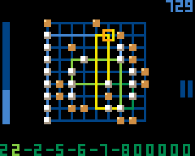

# Go Beaver Go

This program for the [Gamebuino][] lets you edit and run an esoteric programming language.
The language is based on [2L][] with some minor modifications.

[Play or download][GoBeaverGoGB] the game.

## Features

* Ability to Edit programs
* Ability to Run programs
  * Actions: Play, Pause, and Step
  * Variable run speed
  * Intensity-based path tracking
* Tutorial Mode featuring seven challenges
* Challenges Mode featuring twenty puzzles
  * Four types of goals: Output Value, Reach Exit, Run Length, and Create Sequence
  * Progress is stored
* Experiment Mode
  * Ability to Save and Load programs
  * Four metrics: Longest Run, Highest Output Value, Lowest Output Value, and Longest Sequence
  * Progress is stored
* Light effects
* Basic help

## Programming language details

The programming language is two-dimensional.
The instructions are put on a 2D grid, whose size is limited to 9x9.
The directional program pointer (PP) moves across this grid, executing instructions as it encounters them.
It starts just below the left-most cell at the bottom of the grid, moving upwards.

There is also a one-dimensional, infinite tape that acts as data.
All cells of the tape are initially filled with zeros.
The data pointer (DP) points to one of these cells.

The language consist of only two symbols:

*   **TURN**, visualised by a Black square

    When PP would enter a cell with a TURN instruction, it changes direction to prevent this.
    The direction it turns to depends on the value that DP points to:

    *   When the value is zero, PP turns ninety degrees counter-clockwise.
    *   Otherwise, PP turns ninety degrees clockwise.

*   **DATA**, visualised by a White square

    What happens when PP enters a cell with a DATA instruction depends on the direction of PP:

    *   When it is moving up, it increases the value at DP by one.
    *   When it is moving down, it decreases the value at DP by one.
    *   When it is moving right, it moves DP one position to the right.
    *   When it is moving left, it moves DP one position to the left.

Program cells can also be empty, representing a NOOP instruction;
PP simply keeps moving in its current direction.

The program terminates when PP leaves the board.

## About the name

The program is named "Go Beaver Go" as the program grid resembles the [Go][GoTerm] board game and
a [Busy Beaver][BusyBeaverTerm] is a program that runs a long time but eventually terminates. The
main challenge is to find such long-running programs in this 2L domain.

[BusyBeaverTerm]: https://en.wikipedia.org/wiki/Busy_beaver
[Gamebuino]: https://gamebuino.com
[GoBeaverGoGB]: https://gamebuino.com/creations/go-beaver-go
[GoTerm]: https://en.wikipedia.org/wiki/Go_(game)
[2L]: https://esolangs.org/wiki/2L
